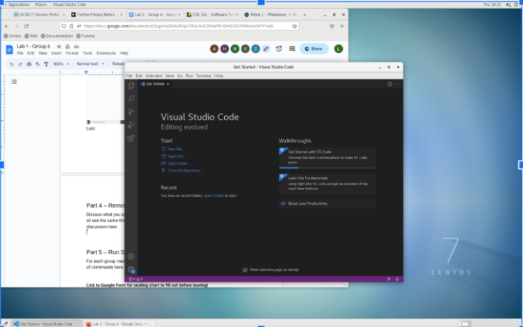
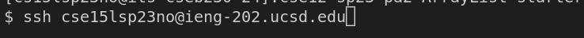
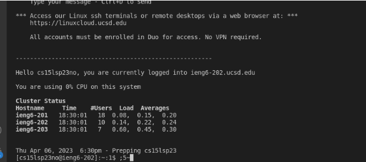
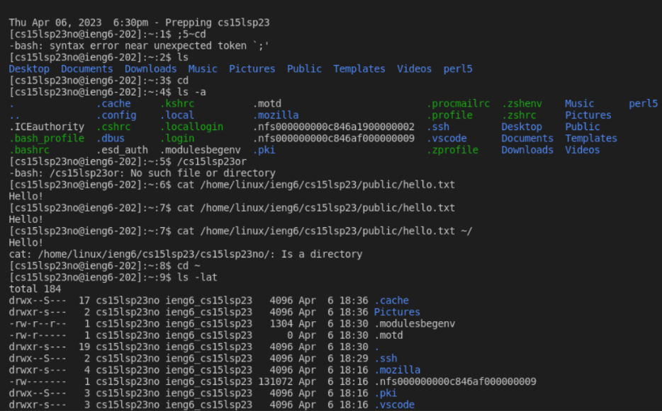

# hello!! This is a short tutorial on how to do what we did in lab! :D :3  >.<
I skipped downloading [VS Code](https://code.visualstudio.com/) into my laptop because I used the CSE computers. In order to open VS code on the computers follow these simple steps:
1. Log into the computer. I used Linux so I used my course specific username and password to log in. 
2. Then click the top left where it says **Applications**.
3. Then find the **Progamming** section then find **VS Code** in the sub section of **Programming**.
4. You have successfully opened VS Code!

# Now we will log into VS code remotely!
Open a new terminal clicking terminal on the top and then clicking new terminal.
1. First type in the code that is in the LAB instructions: ssh cs15lsp23zz@ieng6.ucsd.edu. This line of code uses your personal username in order to establish a connection to your account remotely. So your code should be the same except the two z's behind the @ should relfect your own username.
2. In order to find your course specific account (which includes your username) you must manually search it up on the this [website](https://sdacs.ucsd.edu/~icc/index.php). Then promptly reset your password so that you may login to it when you ssh remotely.
3. For me it didn't work, so we figured it out! Yippeeee! We wrote -202 after ieng6 and it allowed me to input my password. This was the code I used (minus my personal account username of course): ssh cs15lsp23zz@ieng6-202.ucsd.edu.
4. After inserting my password the following code was the output:

# Now that we're logged in we can start having fun a mess with code!
1. Try inputting certain commands like:
>Blockquote cd : this pulls you into a specific directory/file or it can lead you to a previous file if empty`
>Blockquote ls -lat : tells you when these file were made?`
>Blockquote ls -a list all the files in your current system`
>Blockquote ls <directory> : tells you the current directory you are in?`
2. After typing these you should expect a lot of different outputs.
Try messing around with the input too!

