# hello! Lab Report 2: Servers and bugs (ew bugs! XP)
## Part 1 :p
The code below is the code for our String Server program:

` import java.io.IOException;`

` import java.net.URI;`

` class Handler implements URLHandler {`

  ` // The one bit of state on the server: a number that will be manipulated by`
  
   `// various requests.`
   
   `String word=" ";`
   
   `public String handleRequest(URI url) {`
   
       `if (url.getPath().equals("/")) {`
       
           `return word;`
           
       `}`
       
       `else {`
       
           `System.out.println("Path: " + url.getPath());`
           
           `if (url.getPath().contains("/add-message")) {`
           
               `String[] parameters = url.getQuery().split("=");`
               
               `if (parameters[0].equals("s")) {`
               
                   `word += (parameters[1])+"\n";`
                   
                   `return String.format("%s was successfully added!", parameters[1]);`
                   
               `}`
               
           `}`
           
           `else if(url.getPath().contains("/search")){`
           
               `String[] parameters=url.getQuery().split("=");`
               
               `String wordFound= new String();`
               
               `if (parameters[0].equals("s")){`
               
                   `String[] find= word.split("\n");`
                   
                   `for (int i=0; i<find.length;i++){`
                   
                       `if (find[i].contains(parameters[1])){`
                       
                           `wordFound+=find[i]+"\n";`
                           
                       `}`
                       
                   `}return wordFound;`
                   
               `}`
               
           `}return "404 Not Found!";`
           
       `}`
       
   `}`
   
`}`

`class StringServer {`

   `public static void main(String[] args) throws IOException {`
   
       `if(args.length == 0){`
       
           `System.out.println("Missing port number! Try any number between 1024 to 49151");`
           
           `return;`
           
       `}`
       
       int port = Integer.parseInt(args[0]);`
       
       
       Server.start(port, new Handler());`
       
(I ended up coding a search method cause I thought it was required....and then it wasn't.)
First we must compile the code so this program can even run/work at all as well as the code for Server.java. We compile the code using *javac StringServer.java Server.java*.
and voila! we have compiled the code! Now we can run it using java StringServer (along with the parameters it requires such as the port number of course).
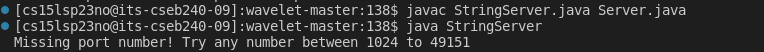

Now once we insert the port number we can create our own server! (basically a very empty website lol). And the creation of this server can be attributed to the code below:
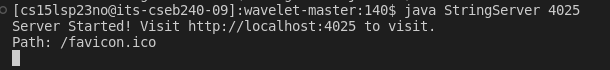

Now once we start the server we can open it and see that it is completely empty D:! This is because of the following code which establishes the empty display:
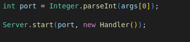

This is the server that was started! 
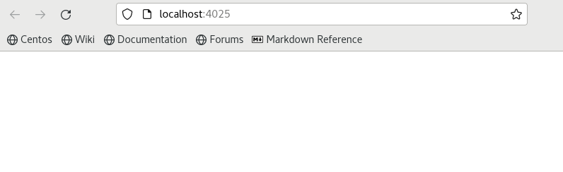

Now, let us add some strings into our empty list! To do this we will write *add-message?s=* into our URL.
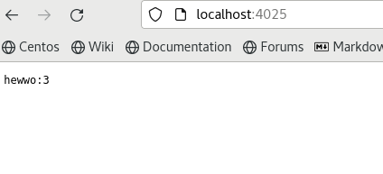

This is the result of the following code (which adds the string after *s=* into the string variable *word*:
` String word=" ";

   public String handleRequest(URI url) {
       if (url.getPath().equals("/")) {
           return word;
       }`
This is now our NEW website/server (it contains a silly word now lol)!
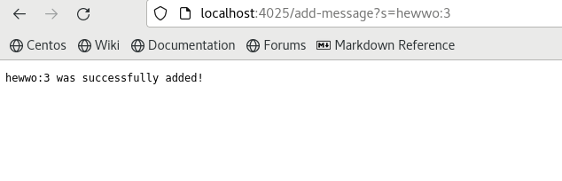

Now lets concatonate another word! And this is the result:
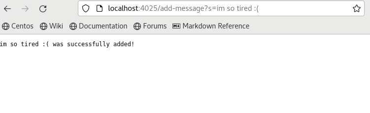

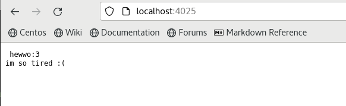

## yaaayyy! Now on to part 2! Debugging :( booooo!
1. Failure Inducing Input: 
`@Test
public void testReverseInPlace2(){
   int[] input1={1,2,4};
   ArrayExamples.reverseInPlace(input1);
   assertArrayEquals(new int[]{4,2,1},input1);
  }`
Plus the associated code!:
`static void reverseInPlace(int[] arr){
   for (int i=0;i<arr.length/2;i++){
      arr[i]=arr[arr.length-i-1];
      }
   }`
When we try run our test we get this error:
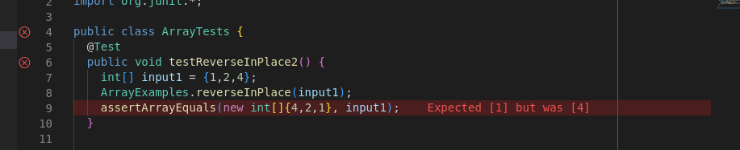

But if we try to run a test with only one number we get this:
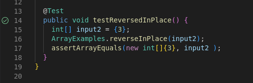

As we saw in the associated code above, when we look at the condition of the `for loop` we notice that we only cover half of the of the integer list instead of all of it. This means we aren't able to copy the entire list but just one half of it. 
In order to fix this we need to add a place holder! This place holder is used to store an element (at a specific index) which then allows us to change the index of the place holder, also changing the index of that certain element! wow! so genius! (im running on caffiene right now)
`static void reverseInPlace(int[] arr){
   for (int i=0;i<arr.length/2;i++){
      int temp=arr[i];
      arr[i]=arr[arr.length-i-1];
      arr[arr.length-1]=temp;
      }
   }`
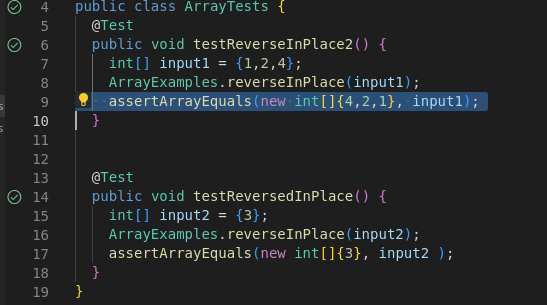
## Now finally for Part 3 (please im so eepy rn D: ):
I learned a LOT in our lab from week 2 and 3. I learned how to compile and run code and why that's even a thing. I learned what bash was and realized that there are different types of terminals! And I also learned about the directories and paths and how to use them in my own coding. Bbut most importantly, I learned how to use *tab*, this thing has saved me SO much time, I wish I could give it a big hug.
