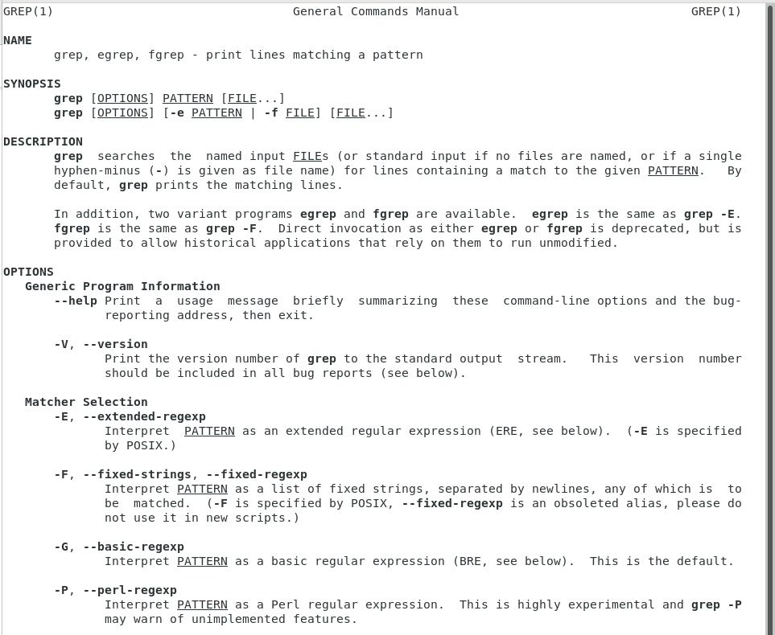
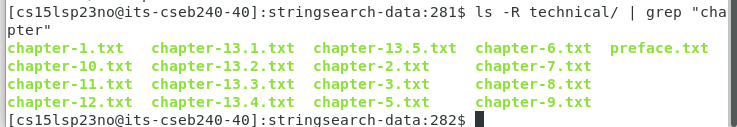

# Lab Report 3! Exploring commands for grep!
For this entire part of the lab I will be getting different commands from using ` man grep ` which gives me many options and informative descriptions. 
Here is a picture of what comes up when we use this command:

## Using ls and grep together : listing files with a word that grep looks for
By using ` ls ` and ` grep ` together we can create a sort of list of files that all contain a specific word in their name
For example, we can search for all files that contain "chapter" in their file name by using ` ls -R technical/ | grep "chapter" and the results are in the image below"

Here is another example of us looking for files that contain pmed in their name:

