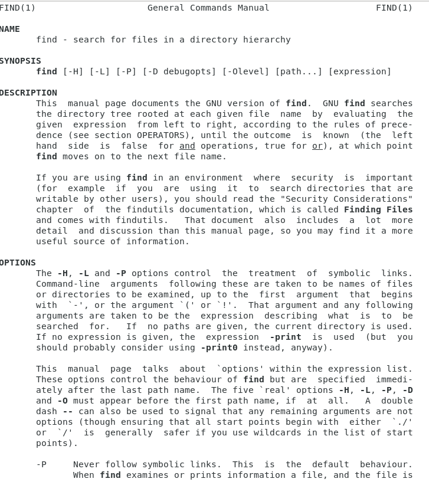

# Lab Report 3! Exploring commands for grep!
For this entire part of the lab I will be getting different commands from using **man grep** which gives me many options and informative descriptions. 
Here is a picture of what comes up when we use this command:

## -name : searching for a specific character in a given text
