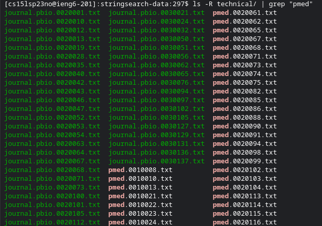
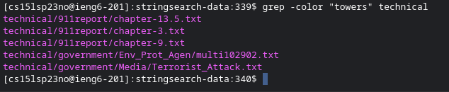
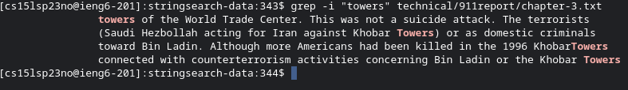

# Lab Report 3! Exploring commands for grep!
For this entire part of the lab I will be getting different commands from using ` man grep ` which gives me many options and informative descriptions. 
Here is a picture of what comes up when we use this command:

## Using ls and grep together : listing files with a word that grep looks for
By using ` ls ` and ` grep ` together we can create a sort of list of files that all contain a specific word in their name
For example, we can search for all files that contain "chapter" in their file name by using ` ls -R technical/ | grep "chapter" `and the results are in the image below"

Here is another example of us looking for files that contain pmed in their name:

## -color: the super cool feature that lets you color code a specific word in a text file!
Lets use some specific text files in our 911reports directory and color code, let's say "towers" (I'm sorry if that insensitive LOL). We would then type ` grep --color=always "towers" technical/911report/chapter-3.txt ` this is the result

Let's try again but this time with a word and file that would yield a much larger response!

by the way it took me a LONG time to figure out how to return the actual color coded lines using ` --color=always ` because using jsut color would only give us back the name of the files colored. As seen below:

## -i : a way to find which lines contain a word insensitively!
By using ` grep -i "word here" technical/911report ` we can find specific words that aren't case sensitive! this means that if we search for DNA we would get all variations such as dNA DnA and dna!
Here is an example of me using -i:

You may not notice much difference because all words have the same case (9/11) but let's try another example!

in this example we can clearly see that even though we searched for "towers" we also get "Towers" different capitalization of the same word! awesome!
## recursive searching using -r !!
By using the command -r we can recursively search for files rather than simply doing it one directory at a time.
So for example we would write ` grep -r "9/11" technical ` and it would recursively find all files with 9/11 in them and show us the text. Image below:

Here's another example where we use ` grep -r "cow" technical" ` and find all the files with cow in them:

However, it's important to remember it looks for any words that contain cow, which means if you are looking for JUST the word cow then this feature would probably not be the best option. :(

