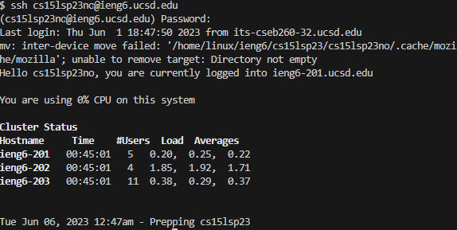
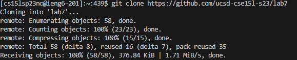
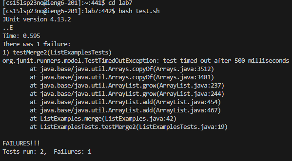
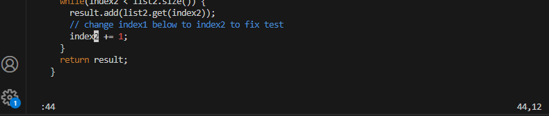
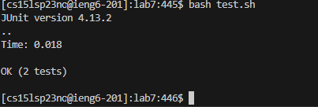
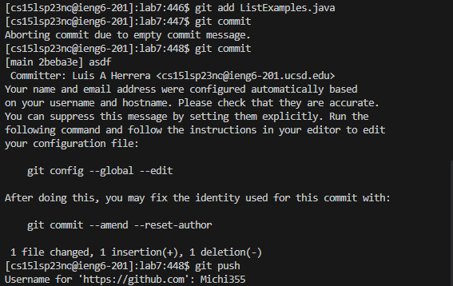

# Lab Report 4 - Practicing with VIM and Bash!
In this lab report we are going to be doing everything through the terminal! Editing and debugging a file then pushing that final so that it updates!
## Instructions to Setup!
1. Delete any existing forks of the repository
2. Fork the repository then set the timer shortly after!
3. Long into ieng6 (ssh)
4. Clone the repository
5. Run tests to show that they fail
6. Edit the file to fix the test
7. Run the test so that now they run successfully 
8. Commit and push all the changes you made to the old code(you can pick any commit message!)
## Step 4.
Keys pressed: 
` ssh <space> cse15lsp23no@ieng6.ucsd.edu <enter> `

This is the step where we log into our cse 15l accounts and below is a screenshot:

## Step 5.
Next we type 
` git <space> clone <space> https://github.com/ucsd-cse15l-s23/lab7 <enter> `
which clones lab7 into our ssh account so that we can access it.

## Step 6.
Next we type
` cd <space> lab7 <enter> `
then we type
` bash <space> test.sh <enter> `
which moves us into the lab7 directory and allows us to run the test.sh script

## Step 7.
Next we type 
` <vim <space> ListExample.java <enter> `
then we type 
` :44 <enter> er2 <enter> `
this is a neat trick my lab partner taught me about! :44 moves us to line 44 where we have to do the edit and e moves us to the end of the word and r2 replaced the 1 to a 2!
This was much faster than using the keys to navigate the file in vim.

Make sure you type 
` :wq ` 
in order to save the file!!!!

## Step 8.
Now we bash run the script again to make sure it runs! 
` bash <space> test.sh <enter> `

## Step 9.

Now we run the commands
` git add <enter> `
` git commit <enter> then press ga <enter> then add a commit message then type :wq <enter> `
then insert your info and you're done!
  
  
  
  voila!
