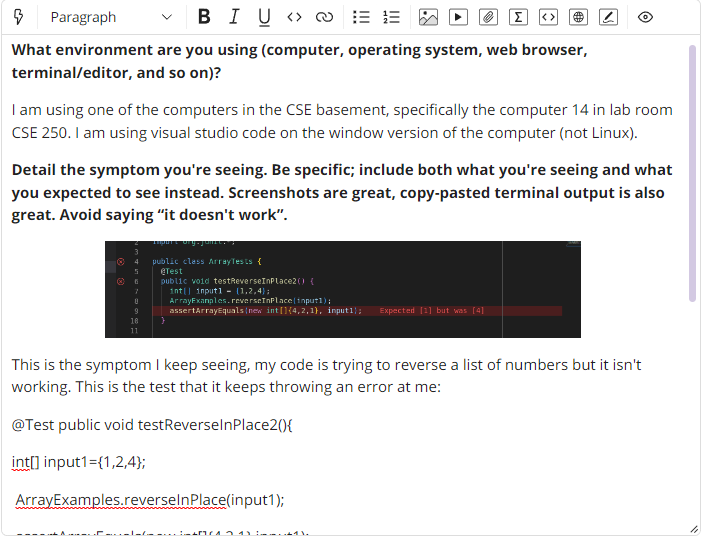
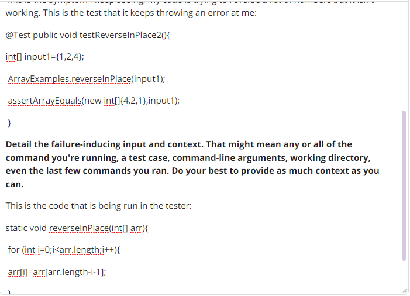

# Lab Report 5: Pretending to be a TA to fix and debug a student's code
For this lab let me start with the first thing I'd see as a TA, the student question post on EdStem.
The post includes a lot of detail, including the environment we're working in, what the issues is specifically (error code) and more context to understand what is even happening.
Here a screenshot of the post created by a mysterious, ominous student! (me lol):

Plus here is the bash file the student used to test their code, this is the only code I ran (just the bash script):

Is the issue somewhere in the code, or did I write my tester wrong?

# TA response
Hmmm, this is very interesting. If the error is in your tester so let's check out your code before determining whether or not the tester code is the issue.
The first thing I notice when we anaylize your code is that you are iterating through the entire list, which means that if you change the index of a specific point in the list, it changes back because you are essentially changing this twice which means its reverting back to normal.
Try fixing the iterating condition!
Another issue I can see is that your code is using data that is constantly being changed, which means that if you had a much longer list the data would start getting mixed up.
One way to fix this is to introduce a temp variable into the for loop so that the data you are using to alter the list stays constant rather than it constantly changing. 

# Student response
Wow! After several trials and errors I think I finally did it! 
This was the final code I ended up writing:

`  static void reverseInPlace(int[] arr) {
    for(int i = 0; i < arr.length/2; i += 1) {
      int temp=arr[i];
      arr[i] = arr[arr.length - i - 1];
      arr[arr.length - i - 1]=temp;
    }
  } `
  Thank you so much for your help!
  
   
  
  Now my test is running correctly! 
  
  # Reflection
  One of the best things that my tutor taught was the use of SCP. I don't have a personal laptop so I move from PC to PC and scp really helps me edit files in visual studio code using my ssh! 
  It is very convenient and I was told I'd be using it a lot in cse 30, so I am grateful yet also amazed at how there is a specific thing for almost anything in coding!
